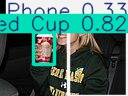

Object Detection using YOLOv8
This project implements an object detection system using Ultralytics YOLOv8.
The model is trained to detect everyday objects.

Objects Detected
Red Cup
Blue Bottle
Phone

The objective of the project is to simulate a computer vision system for a small robot that can recognize objects in real-world environments.

Project Workflow
The project was completed in the following stages.

1. Dataset Collection
   Images were collected from openly licensed sources on Wikimedia Commons.
   The dataset includes images of:

Blue bottles
Red cups
Mobile phones

The images contain variation in:

viewing angles
object distance
lighting conditions
backgrounds

This variation helps the model generalize better.

2. Data Annotation
   Images were labeled using Roboflow.
   Bounding boxes were drawn around each object and assigned a class label.
   Classes Used

Blue Bottle
Red Cup
Phone
Object

3. Data Preprocessing and Augmentation

The following preprocessing and augmentation techniques were applied.

Preprocessing - Auto orient images

Augmentations - Rotation, Brightness adjustment

These techniques help improve model robustness under different conditions.

4. Dataset Format
   The dataset was exported in YOLOv8 format.
   Dataset structure:

dataset/
├── train
│ ├── images
│ └── labels
├── valid
│ ├── images
│ └── labels
└── test
├── images
└── labels

Dataset configuration file (data.yaml):

nc: 4
names: ["Blue Bottle", "Object", "Phone", "Red Cup"]
Dataset Access
The dataset folder is excluded from the repository using .gitignore because of its large size.

Dataset can be accessed here:
https://app.roboflow.com/manasis-workspace-kcvqj/new-project-cpor5/2

Model Training
The model was trained using pretrained weights from YOLOv8.

Training configuration

Model: yolov8n.pt
Epochs: 50
Image size: 640

Training was performed in a Jupyter Notebook environment.
The trained weights are saved as:

runs/detect/yolo_training/weights/best.pt

Inference Scripts

A separate scripts/ folder was created to run object detection using the trained model.

scripts/
├── image_detection.py
├── video_detection.py
└── webcam_detection.py
Image Detection

Detect objects in a single image.
python scripts/image_detection.py
Video Detection
Detect objects in a video file.
python scripts/video_detection.py
Webcam Detection
Run real-time object detection using the laptop webcam.
python scripts/webcam_detection.py

This demonstrates the real-time detection capability of YOLO.

Sample Detection Results

Below are examples of object detection results produced by the trained model.

Detection Example 1
Detection Example 2
Webcam Detection

Project Structure
Object_Detection_YOLO
│
├── notebooks
│ └── yolo_training.ipynb
│
├── scripts
│ ├── image_detection.py
│ ├── video_detection.py
│ └── webcam_detection.py
│
├── results
│ └── sample detections
│
├── data.yaml
├── requirements.txt
└── README.md
Git Ignore

Large files are excluded from the repository.

Data/
runs/
\*.pt
.DS_Store
Results and Observations

The trained model successfully detects:

Blue bottles
Red cups
Phones

The detector performs well on test images and webcam input.

Performance may decrease when:

objects are heavily occluded
lighting conditions are poor
objects are very small in the frame

Increasing the dataset size and training for more epochs could improve accuracy.

## Sample Detection Results

Below are examples of object detection results produced by the trained YOLOv8 model.

### Detection Example 1

